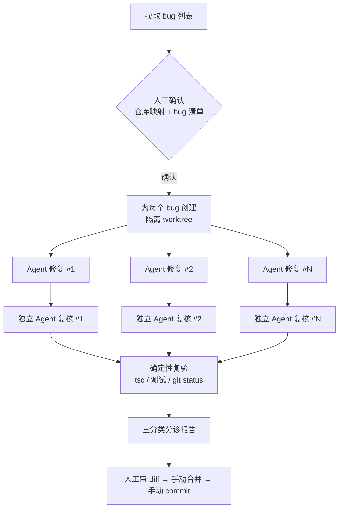

<h1 align="center">batch-fix-bugs</h1>

<p align="center">
多 Agent 并行修复缺陷的工作流 —— 以及一套让 AI 产出「可审」而非「可信」的设计。
</p>

<p align="center">
<a href="#核心设计">核心设计</a> ·
<a href="#适配器为什么这层不是转发">适配器</a> ·
<a href="#怎么跑起来">怎么跑起来</a> ·
<a href="#已知局限">已知局限</a> ·
<a href="#相关文章">相关文章</a>
</p>

---

## 这是什么

一个基于 [Claude Code](https://claude.com/claude-code) 的工作流：从缺陷管理系统拉一批 bug，**每个 bug 派一个 Agent 在独立的 git worktree 里修**，再派**另一个独立 Agent 对抗式复核**它的 diff，最后产出一份三分类的分诊报告。

**它默认不 commit、不 push、不回写缺陷系统。** 输出是「待审材料」，不是「已完成的事」。

缺陷系统通过[适配器](#适配器为什么这层不是转发)接入，禅道 / GitHub Issues / Jira 都行。仓库自带一个 mock 适配器，**不接任何真实系统就能跑通全流程**。

## 它解决的不是你以为的那个问题

第一版我只做了"并行修 bug"这件事。跑完一轮，每份报告都写着"已确认修复正确，无回归风险"。

我一条条审 diff，**错的不在少数**。而且错的那几份，说明写得比对的还详细——根因、改动说明、验证结论一应俱全，逻辑通顺。不逐行看 diff 根本看不出来。

> **难点从来不是「AI 能不能改对代码」。是你没有办法，在不逐行读完的前提下，知道哪几个是对的。**

一个你不敢信的自动化系统，比没有还糟：你不但要审所有 diff，还得先揣摩 AI 当时在想什么。

这个仓库里的所有设计，都是在回答这一个问题。

## 流程



修复与复核之间**没有屏障**：一个 bug 修完立刻进复核，不等其他 bug。

## 核心设计

这几条是这个仓库真正的内容。每条背后都有一个踩过的坑。

### 1. 复核必须是另一个 Agent

让修复 Agent 自查是无效的——自查和修复共享同一份上下文，它在**确认自己的推理**，不是检验结果。就像校对自己写的文章，错别字永远看不见。

复核 Agent 拿到 diff 和结论，但**拿不到修复 Agent 的推理过程**。给了推理过程，它会去判断"这段推理听不听得通"，而不是"这个 diff 能不能修好这个 bug"——前者太容易过关。

bug 的原始描述也由它**自己去拉**，不接受二手转述。转述是有损的：修复 Agent 理解错了期望行为，复核 Agent 就会拿着同一个错误标准去验收，两个 Agent 一起错，还错得高度一致。

### 2. 「不确定」必须是一等公民

verdict 有三个值，不是两个：

```js
verdict: { enum: ['pass', 'needs-human', 'reject'] }
```

只有 pass/reject 的话，模型在不确定时会倒向 `pass`——因为 `reject` 是更强的断言（你说它错了就得说出错在哪），而"我说不准"在 reject 那一侧无法表达。

> **二分类的结构本身在制造假阳性。给模型一个诚实的出口，它才不会撒谎。**

修复端还有一个独立的 `needsHuman` 标志。两端捕获的是不同的东西：修复端知道**过程**（我没找到代码、业务预期有歧义），复核端知道**结果**（这 diff 修的不是这问题）。而过程的不确定性**在 diff 里是看不出来的**。

### 3. 判断题交给模型，事实题自己跑

复核 Agent 也是 LLM，它一样会把"我看了一眼"说成"我验证过了"。再叠一个复核 Agent 只是把问题往后推一层。

出路是**换一种验证方式**——分清两类问题：

- 「这个改动能不能修好这个 bug」→ **判断题**，只能交给模型
- 「`tsc --noEmit` 的退出码是几」→ **事实题**，跑一下就知道

第二类之所以混进模型职责，是因为它以**自述**的形式出现（Agent 在 `checksRun` 里写"已执行 type-check，通过"）。那句话读起来像结论，其实是个待核实的声明。

所以主会话在出报告前会自己跑一遍，不采信任何自述：`tsc --noEmit` 要求退出码 0 且零输出、相关测试套件实跑、`git status` 只允许出现预期的改动文件（Agent 经常留下调试脚本，而它不会汇报这个——它汇报的是"我改了什么"，不是"我留下了什么"）。

> **能用确定性检查回答的问题，就别让模型回答。**

### 4. 约束放在架构里，不是放在 prompt 里

最硬的一条红线：**没有真实 commit hash，禁止回写缺陷系统。**

因为当一个字段必须填、而正确答案不可得时，模型会填一个格式正确的值——一串完全合法的 40 位十六进制。这条假记录污染的不是本地环境，是**整个团队对「这个 bug 修没修」的共识**，而且很难发现、很难回滚。

但实现方式不是在 prompt 里写"请不要回写"。是**架构上不给它这条路**：workflow 的返回值里没有任何提交动作，回写走完全独立的另一条流程，两条路径在代码层面不连通。

> **你在 prompt 里写十遍「绝对不要 X」，都不如系统里根本没有 X 这个函数。**

判断一个动作该不该交给 AI，别问"它能不能做对"，问"**它做错了，谁来收拾、收拾得掉吗**"。

### 5. 物理隔离，以及隔离没堵住的那条缝

每个 bug 一个 `git worktree`，文件冲突和 `git status` 污染就都没了。

但 `node_modules` 是软链共享的（每个 worktree 装一遍太慢太占地方），这就把它们重新连回了一个共享资源。所以有条线必须划清楚：

> **共享只读状态是安全的，共享可写状态是危险的。**

依赖包是只读的，可以共享；而 `build` 会写 `.cache` / `dist` 这类共享位置，N 个 Agent 同时 build 就是数据竞争。所以 Agent **只被允许跑非写型检查**（type-check / lint / 相关单测），禁止全量 build。

这是有代价的取舍，不是免费的——见[已知局限](#已知局限)。

### 6. 人工卡点放在扇出点之前

两处硬卡点，不确认不往下走：**项目 → 仓库的映射**，和**待修 bug 清单**。

卡点不该均匀撒在流程里——那只会让人疲劳到闭眼点确认。要放在**扇出点之前**：一个决策后面挂着多少并行动作，它就值多少审查成本。

仓库映射这一步选错了，后果放大 N 倍——**N 个 Agent 在一个错误的仓库里认真地改了一堆代码**，而且不会报错，会给你一份格式完美的报告。

## 适配器：为什么这层不是转发

工作流本身不知道你的 bug 存在哪里，它只依赖一个满足契约的可执行程序：

```bash
<adapter> list --project <p> [--filter <f>]   # → { issues: [{ id, title, severity, url }] }
<adapter> show <id>                            # → { steps, expected, actual, ... }
<adapter> check                                # 自检配置/鉴权
```

抽这一层的**真正理由不是"换个系统方便"**——那只是副产品。

真正的理由是：**各家缺陷系统给出的数据形状，和 Agent 需要的形状，不是一回事。**

禅道把「重现步骤」和「期望结果」揉在同一个 `steps` 字段里，值还是一段 HTML；GitHub 则散在 markdown 正文的各级小标题里，严重程度还得从 label 猜。而复核 Agent 要判断「这个改动到底修好了没有」，它需要一个明确的**期望行为**当判据——混在 HTML 或 markdown 里的一段自由文本不构成判据。

所以适配器承担的是归一化的脏活：清 HTML、拆出 `expected`、把各家的严重程度映射到统一刻度。

> **一层只做转发的抽象是没有价值的。适配器的价值在于它承担了归一化的脏活。**

其中 `expected` 是唯一需要动脑子的字段，也定下了一条规矩：**提取不到就给 `null`，绝不编造。** 编一个期望行为出来，会让复核 Agent 拿着错误的判据去验收——比没有判据糟得多。工作流拿到 `null` 会明确告诉 Agent「本条没有期望行为，推断不出来就标 needs-human」。

跟工作流内部是同一条原则：**给「不知道」留一个位置，比强行填一个值安全。**

| 适配器 | 依赖 | 说明 |
|---|---|---|
| `adapters/mock.js` | 无 | 读本地 fixture，**零配置**，跑通流程和改 prompt 用 |
| `adapters/github.js` | [`gh`](https://cli.github.com/) | 从 labels 推 severity、从 markdown body 拆 expected |
| `adapters/zentao.js` | zentao-cli | 清 HTML、从自由文本里拆 expected |

写一个新的大约 60 行，契约和示例见 **[ADAPTERS.md](ADAPTERS.md)**。

归一化逻辑有测试，零依赖直接跑：

```bash
node adapters/github.test.js   # 21 个用例
node adapters/zentao.test.js   # 14 个用例
```

## 怎么跑起来

**前提**（说在前面，省得你往下读）：

- [Claude Code](https://claude.com/claude-code)，且需要 Workflow 能力
- 目标项目是 git 仓库，Node 项目（type-check / lint 走 `package.json` 的 scripts）
- 一个缺陷系统适配器 —— **先用自带的 mock，不需要任何外部系统**

```bash
git clone <repo-url> && cd batch-fix-bugs

# 先确认适配器能跑（mock 零配置，不接任何系统）
node adapters/mock.js check
node adapters/mock.js list --project demo

cp commands/batch-fix-bugs.md            ~/.claude/commands/
cp workflows/batch-fix-bugs.workflow.js  ~/.claude/workflows/
```

要接真实系统，复制 `.env.example` 成 `.env` 填上对应变量（`GH_REPO` 或 `ZENTAO_CLI`），然后：

```bash
node adapters/github.js check      # 或 zentao.js
```

在 Claude Code 里：

```
/batch-fix-bugs <项目名> [过滤类型] [max=N]
```

跑完会在持久目录生成 `REPORT.md`，改动留在各自的 worktree 分支里等你审。

> ⚠️ **worktree 目录必须放持久位置，不要放会话临时目录。**
> 那些未合并的改动就是交付物，会话一清就没了。

**改 prompt 的时候建议先挂 mock 跑**：不消耗真实系统调用、数据固定所以结果可比、而且不会手滑往真实缺陷系统里写东西。

## 已知局限

放在这么显眼的位置，是因为这些是真问题，不是免责声明。

- **从来没真的把代码跑起来过。** 只跑非写型检查，UI 交互类 bug（"点了没反应"）靠 type-check 是验证不出来的，最终还得人打开浏览器点一遍。想做但没做的是接浏览器自动化，按重现步骤实际操作验证。
- **复核只有一票。** 更稳的做法是多视角（正确性 / 边界 / 破坏其他调用方）各判一次投票，两票以上才 pass。没做是因为成本翻三倍。
- **`max=8` 是拍脑袋的数** —— 它不是机器的极限，是**人一次能认真审几个 diff 的极限**。自动化把瓶颈从"改代码"推到了"审代码"，推后了一格，但没有消灭它。所以这个数不该调大，真要提吞吐得先提高每个 diff 的可信度。
- **只看 diff，看不见隐式耦合。** 一个函数被十几处调用、一个字段被其他模块按约定读取——这些跨文件的耦合在 diff 里是隐形的。
- **`expected` 的提取质量决定复核环节的成色。** 缺陷单写得糊、没写期望行为，复核就是空转。适配器会给 `null` 而不是编造，但那只是不制造假阳性，不能凭空造出判据。
- **没有度量。** 我不知道假阳性率到底是多少，只有"感觉比第一版靠谱"这种主观印象。要真正回答需要一套评测集。**没有评测，所有优化都是凭手感。** 这是它和一个能上生产的 AI 系统之间最本质的差距。

## 相关文章

设计决策的完整推导写在这里，比 README 详细得多：

- 《8 个 Agent 同时改一个仓库，我踩了哪些坑》—— worktree 隔离与并发编排 ⟦上篇链接⟧
- 《AI 说「修好了」，凭什么信》—— 对抗式复核、三分类、确定性复验与红线 ⟦下篇链接⟧

## License

[MIT](LICENSE)
